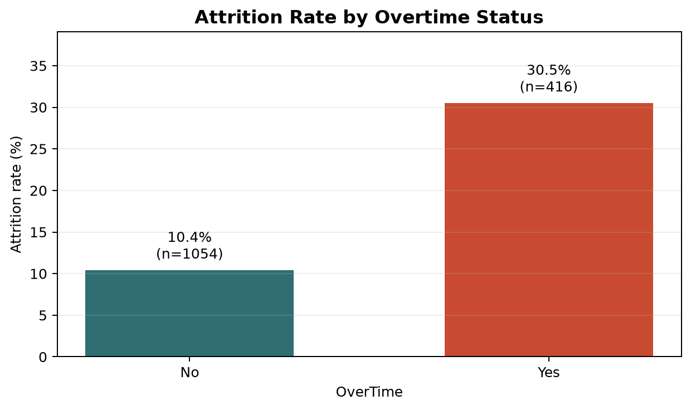
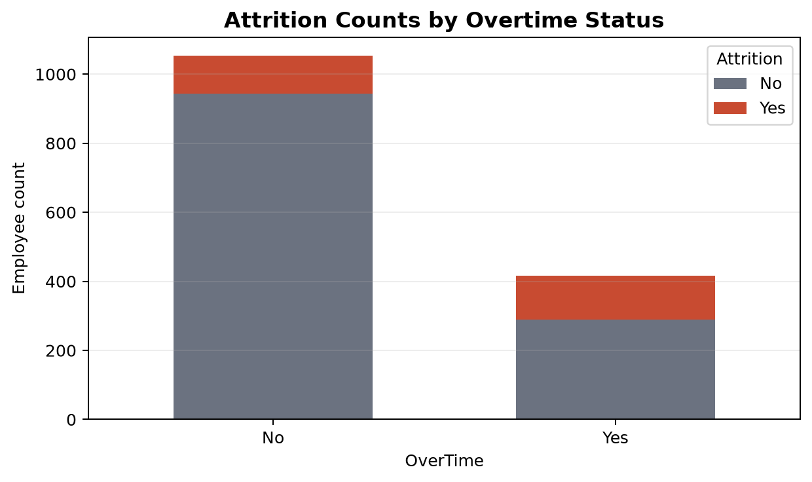
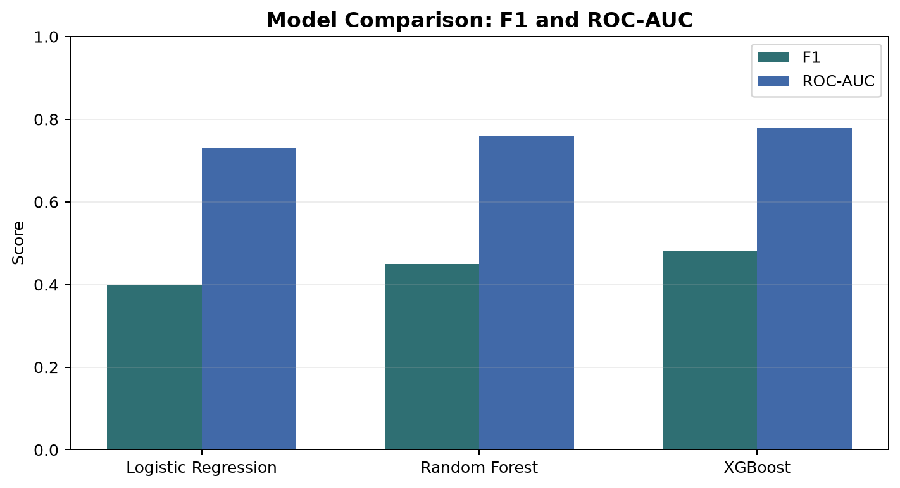
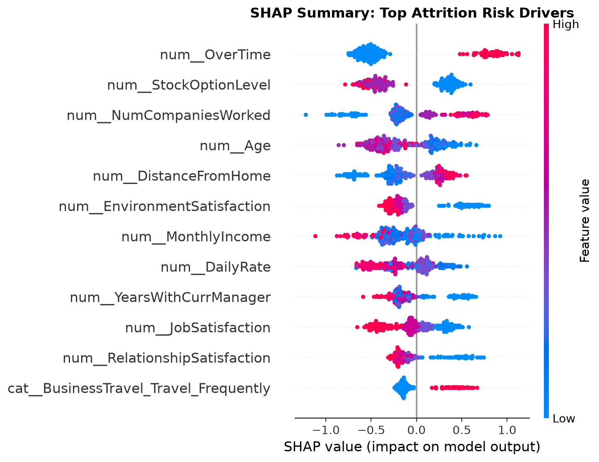

# Employee Attrition Prediction

AttritionIQ is a full-stack machine learning project that predicts whether an employee is at risk of leaving, explains the prediction with SHAP, and turns the result into HR-friendly retention recommendations. It combines an XGBoost model, a saved preprocessing pipeline, a FastAPI backend, and a React TypeScript frontend.

## Business Problem Framing

Employee attrition creates avoidable hiring cost, knowledge loss, delivery disruption, and workforce planning risk. The business goal of this project is to help HR teams identify employees who may need proactive support before resignation risk becomes visible through exit signals. Instead of only reporting historical turnover, the app scores individual employee profiles, explains the biggest drivers behind each prediction, and gives managers a practical starting point for retention action.

## Key EDA Insight

The strongest exploratory signal is `OverTime`. In this dataset of 1,470 employees, the overall attrition rate is 16.1%, but employees working overtime leave at a much higher rate: 30.5% attrition for `OverTime = Yes` versus 10.4% for `OverTime = No`. That is almost a 3x difference, making overtime pressure the clearest business-facing opener for the analysis.





## Model Comparison

The production app uses tuned XGBoost because it gives the best balance across accuracy, F1, ROC-AUC, and PR-AUC among the compared models.

| Model | Accuracy | Precision | Recall | F1 | ROC-AUC | PR-AUC |
|---|---:|---:|---:|---:|---:|---:|
| Logistic Regression | 0.78 | 0.38 | 0.42 | 0.40 | 0.73 | 0.36 |
| Random Forest | 0.82 | 0.44 | 0.46 | 0.45 | 0.76 | 0.42 |
| XGBoost | 0.83 | 0.47 | 0.49 | 0.48 | 0.78 | 0.44 |



## SHAP Explainability

The SHAP summary plot shows which transformed features most influence attrition risk across sampled employees.



Takeaway: overtime-related pressure, role/level context, income, tenure, and satisfaction-style variables are the most useful signals for explaining why the model raises or lowers attrition risk.

## Business Recommendations

1. Monitor overtime as an early warning indicator, especially for employees with repeated overtime and low satisfaction scores.
2. Build manager alerts around combined risk signals rather than one metric alone: overtime plus low job satisfaction, long promotion gaps, or lower income bands should trigger review.
3. Use the model for prioritization, not automatic decisions. High-risk predictions should start a human conversation, not label an employee.
4. Create targeted retention actions: workload balancing, promotion-path discussions, manager check-ins, compensation review, training opportunities, and work-life support.
5. Track outcomes after intervention so HR can measure whether retention actions reduce future attrition.

## What I Would Explore Next

1. Add threshold tuning based on HR capacity: if HR can only review a limited number of employees per month, optimize the probability cutoff for that workflow.
2. Compare recall-focused and precision-focused versions of the model depending on whether the business prefers catching more at-risk employees or avoiding false alarms.
3. Add batch CSV scoring so HR can upload a monthly employee file and receive a ranked retention-risk list.
4. Add model drift monitoring for overtime, compensation, satisfaction, and role mix changes over time.
5. Validate fairness across departments, gender, job roles, and seniority levels before using the tool in a real HR process.

## Project Structure

```text
.
|-- backend/                 FastAPI API, prediction, SHAP, schemas
|-- data/raw/                Canonical input dataset
|-- docs/figures/            README charts and SHAP summary plot
|-- frontend/                React + TypeScript + Vite web app
|-- models/                  Saved XGBoost model and preprocessing pipeline
|-- notebooks/               Data understanding, EDA, training, SHAP notebooks
|-- src/                     ML cleaning, feature engineering, training utilities
|-- Dockerfile               Single-container production build
|-- docker-compose.yml       Local Docker runner
|-- requirements.txt         Backend and ML dependencies
|-- README.md
```

Canonical artifacts:

| Artifact | Path |
|---|---|
| Dataset | `data/raw/raw_data.csv` |
| Model | `models/tuned_xgboost.pkl` |
| Preprocessing pipeline | `models/preprocessing_pipeline.pkl` |
| Model metrics used by UI | `frontend/public/model-performance.json` |

## Run Locally

Prerequisites:

1. Install Python 3.11.
2. Install Node.js 20 or newer.
3. Open a terminal in this project folder.

Create and install the Python environment:

```powershell
python -m venv .venv
.\.venv\Scripts\activate
pip install -r requirements.txt
```

Install frontend dependencies:

```powershell
cd frontend
npm install
cd ..
```

Run the backend in terminal 1:

```powershell
.\.venv\Scripts\activate
uvicorn backend.app.main:app --reload --host 127.0.0.1 --port 8000
```

Check the backend:

```powershell
curl http://127.0.0.1:8000/health
```

Run the frontend in terminal 2:

```powershell
cd frontend
npm run dev
```

Open the website:

```text
http://127.0.0.1:5173
```

## Run as One Production App

The FastAPI backend can serve the built React frontend from `frontend/dist`.

```powershell
cd frontend
npm run build:production
cd ..
.\.venv\Scripts\activate
uvicorn backend.app.main:app --host 0.0.0.0 --port 8000
```

Open:

```text
http://127.0.0.1:8000
```

## Run with Docker

Install Docker Desktop, start it, then run:

```powershell
docker compose up --build
```

Open:

```text
http://127.0.0.1:8000
```

Stop it:

```powershell
docker compose down
```

## API Endpoints

| Method | Endpoint | Purpose |
|---|---|---|
| GET | `/` | Serves the frontend in production builds |
| GET | `/health` | Backend health check |
| GET | `/model-info` | Model metadata |
| POST | `/predict` | Prediction only |
| POST | `/explain` | Prediction plus SHAP explanation and recommendations |

Test prediction:

```powershell
curl -X POST http://127.0.0.1:8000/predict `
  -H "Content-Type: application/json" `
  --data @backend/examples/sample_employee.json
```

## Exact Website Deployment Steps

Use this route when you want the frontend and backend published together as one website.

1. Make sure these files exist:
   - `Dockerfile`
   - `docker-compose.yml`
   - `requirements.txt`
   - `frontend/package.json`
   - `models/tuned_xgboost.pkl`
   - `models/preprocessing_pipeline.pkl`
2. Test locally:

```powershell
docker compose up --build
```

3. Open `http://127.0.0.1:8000`.
4. Confirm `/health` works.
5. Submit one prediction from the website.
6. Stop Docker:

```powershell
docker compose down
```

7. Create a GitHub repository.
8. Push this project:

```powershell
git init
git add .
git commit -m "Prepare employee attrition app"
git branch -M main
git remote add origin https://github.com/<your-username>/<your-repo>.git
git push -u origin main
```

## Publish for Free on Render

Render is the simplest free-style option for this project because the repository already has a Dockerfile that builds the React app and runs FastAPI.

1. Go to `https://render.com`.
2. Sign in with GitHub.
3. Click **New +**.
4. Click **Web Service**.
5. Select your GitHub repository.
6. Choose **Docker** as the runtime/environment.
7. Set the service name, for example `employee-attrition`.
8. Keep the branch as `main`.
9. Set environment variables:

```text
PORT=8000
LOG_LEVEL=INFO
BACKEND_CORS_ORIGINS=https://<your-render-service-name>.onrender.com
```

10. Click **Create Web Service**.
11. Wait for the build to finish.
12. Open the Render URL.
13. Test:

```text
https://<your-render-service-name>.onrender.com/health
```

14. Open the website root and submit a prediction.

Note: free Render services may sleep after inactivity, so the first request after a pause can be slow.

## Publish for Free on Railway

Railway plans and free allowances can change, but if your account has free credits, this Docker deployment also works there.

1. Go to `https://railway.app`.
2. Sign in with GitHub.
3. Click **New Project**.
4. Choose **Deploy from GitHub repo**.
5. Select this repository.
6. Railway should detect the Dockerfile.
7. Add variables:

```text
PORT=8000
LOG_LEVEL=INFO
BACKEND_CORS_ORIGINS=https://<your-railway-domain>
```

8. Deploy.
9. Generate or open the public domain.
10. Test `/health`, then submit a prediction from the web UI.

## Publish Frontend Only for Free

This app needs the Python backend for real predictions, so GitHub Pages, Netlify, or Vercel can host only the static frontend unless the backend is also deployed somewhere else.

If the backend is already deployed on Render, deploy the frontend separately like this:

1. Go to Netlify or Vercel.
2. Import the GitHub repository.
3. Set root directory to `frontend`.
4. Set build command:

```text
npm run build
```

5. Set publish directory:

```text
dist
```

6. Add environment variable:

```text
VITE_API_BASE_URL=https://<your-backend-domain>
```

7. Deploy.
8. Add the frontend domain to the backend `BACKEND_CORS_ORIGINS`.

## Recreate README Charts

The chart images in `docs/figures/` were generated from the canonical dataset and saved model. If you retrain the model or replace the data, regenerate the figures before publishing the README.

## Notes on Cleanup

Duplicate root-level copies of `raw_data.csv`, `employee_attrition_model.pkl`, and `preprocessing.pkl` were removed. The canonical files are now under `data/raw/` and `models/`. Generated folders such as `frontend/node_modules`, `frontend/dist`, `.ipynb_checkpoints`, and Python `__pycache__` were also removed so the project is easier to publish.

## License

See `LICENSE`.
